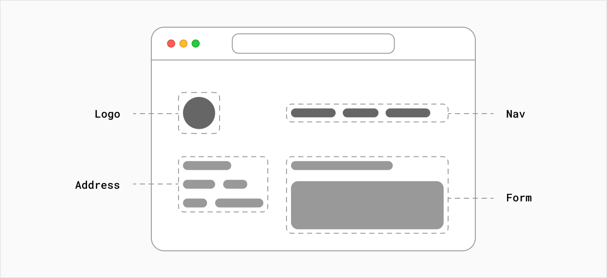

# À propos de Next.js 13

Next.js est un framework React flexible qui vous donne des éléments de base pour créer des applications Web rapides.

Mais qu'entend-on exactement par là ? Passons un peu de temps à développer ce que sont React et Next.js et comment ils peuvent aider.

## Structure d'une application web

Il y a quelques éléments à prendre en compte lors de la création d'applications modernes. Tel que:

- **Interface utilisateur** - Comment l'application est-elle présentée à l'utilisateur et comment l'utilisateur interagit-il avec l'application.
- **Routing** - Comment les utilisateurs accèdent-ils à différentes pages de l'application.
- **Data fetching** - Comment l'application récupère-t-elle les données dont elle a besoin.
- **Rendering** - Comment l'application affiche-t-elle les données récupérées.
- **Integration** - Comment l'application s'intègre-t-elle à d'autres services (CMS, Auth, payement, etc...)
- **Infrastructure** - Comment l'application est-elle déployée et mise à l'échelle.
- **Performance** - Comment l'application est-elle optimisée pour les performances.
- **Scalability** - Comment votre application s'adapte à mesure que votre équipe, vos données et votre trafic augmentent.
- **Developer experience** ou DX - Comment l'application est-elle développée et maintenue.
- **...** - Et bien d'autres aspects que nous ne couvrirons pas dans ce cours.

Pour chaque partie de votre application, vous devrez décider si vous allez créer vous-même une solution ou utiliser d'autres outils tels que des bibliothèques et des frameworks.

## Qu'est-ce que React ?

React est une **bibliothèque** JavaScript pour créer des **interfaces utilisateur** interactives.

Par interfaces utilisateur, nous entendons les éléments que les utilisateurs voient et avec lesquels ils interagissent à l'écran.

Par bibliothèque, nous entendons que React fournit des fonctions utiles pour créer une interface utilisateur, mais laisse au développeur le soin d'utiliser ces fonctions dans son application.

Une partie du succès de React est qu'il est relativement sans opinion sur les autres aspects des applications de construction. Cela a abouti à un écosystème florissant d'outils et de solutions tiers.

Cela signifie également, cependant, que la création d'une application React complète à partir de zéro nécessite un certain effort. Les développeurs doivent passer du temps à configurer des outils et à réinventer des solutions pour les exigences d'applications courantes.

## Qu'est-ce que Next.js ?

Next.js est un **framework** React qui vous donne des blocs de construction pour créer des applications Web.

Par framework, nous entendons Next.js gère les outils et la configuration nécessaires pour React, et fournit une structure, des fonctionnalités et des optimisations supplémentaires pour votre application.

Vous pouvez utiliser React pour créer votre interface utilisateur, puis adopter progressivement les fonctionnalités de Next.js pour résoudre les exigences courantes des applications telles que le **routage**, la **récupération de données**, les **intégrations**, tout en améliorant l'expérience du développeur et de l'utilisateur final.

Que vous soyez un développeur individuel ou que vous fassiez partie d'une équipe plus importante, vous pouvez tirer parti de React et Next.js pour créer des applications Web entièrement interactives, hautement dynamiques et performantes.
