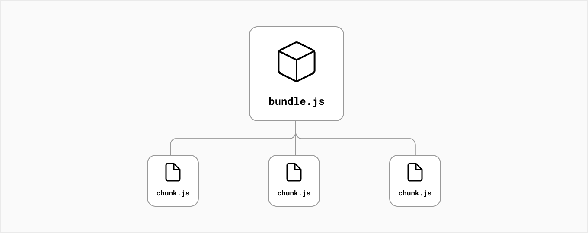

# Comment Next.js fonctionne-t-il ?

Avant d'apprendre des fonctionnalités plus avancées de Next.js, il serait utile de comprendre les bases du fonctionnement de Next.js.

Au début de ce cours, nous avons expliqué à quel point React est relativement sans opinion sur la façon dont vous créez et structurez vos applications - il existe plusieurs façons de créer des applications avec React. Next.js fournit un cadre pour structurer votre application et des optimisations qui permettent d'accélérer à la fois le processus de développement et l'application finale.

Dans les sections suivantes, nous verrons ce qu'il advient de votre code d'application lors de ces différentes étapes :

- L'environnement dans lequel votre code s'exécute : **développement** ou **production**
- Lorsque votre code s'exécute : temps de génération et temps d'exécution. On parlera souvent de **Build Time** et de **RunTime**.
- Où le rendu se produit : **Client** ou **Serveur**

Maintenant, approfondissons ces concepts et discutons de certains des processus que Next.js effectue en coulisses.

## Du développement à la production

Vous pouvez considérer les environnements comme le contexte dans lequel votre code s'exécute.

Pendant le développement, vous construisez et exécutez l'application sur votre ordinateur local. Le passage en production est le processus qui consiste à préparer votre application à être déployée et consommée par les utilisateurs.

### Comment cela s'applique à Next.js

Next.js fournit des fonctionnalités pour les étapes de développement et de production d'une application. Par exemple:

- Dans la phase de développement, Next.js optimise pour le développeur et son expérience dans la création de l'application. Il est livré avec des fonctionnalités qui visent à améliorer l'expérience du développeur, telles que l'intégration [TypeScript](https://nextjs.org/docs/basic-features/typescript) et [ESLint](https://nextjs.org/docs/basic-features/eslint), le [Fast Refresh](https://nextjs.org/docs/basic-features/fast-refresh), etc.
- Dans la phase de production, Next.js optimise pour les utilisateurs finaux et leur expérience d'utilisation de l'application. Il vise à transformer le code pour le rendre performant et accessible.

Étant donné que chaque environnement a des considérations et des objectifs différents, il y a beaucoup à faire pour faire passer une application du développement à la production. Par exemple, le code de l'application doit être compilé, regroupé, minifié et divisé en code. Ces étapes sont effectuées par Next.js en coulisses.

### Next.js Compiler

Next.js gère une grande partie de ces transformations de code et de l'infrastructure sous-jacente pour faciliter la mise en production de votre application.

Cela est rendu possible car Next.js a un compilateur écrit en Rust, un langage de programmation de bas niveau, et SWC, une plate-forme qui peut être utilisée pour la compilation, la minification, le regroupement, etc.

## Les processus de compilation
---

### Compilation

Les développeurs écrivent du code dans des langages plus _developer-friendly_, tels que JSX, TypeScript et les versions modernes de JavaScript. Bien que ces langages améliorent l'efficacité et la confiance des développeurs, ils doivent être compilés en JavaScript avant que les navigateurs puissent les comprendre.

La compilation fait référence au processus consistant à prendre du code dans un langage et à le produire dans un autre langage ou une autre version de ce langage.

Dans Next.js, la compilation se produit pendant la phase de développement lorsque vous modifiez votre code et dans le cadre de l'étape de génération pour préparer votre application pour la production.

### Minification

Les développeurs écrivent du code optimisé pour la lisibilité humaine. Ce code peut contenir des informations supplémentaires qui ne sont pas nécessaires à l'exécution du code, telles que des commentaires, des espaces, des retraits et plusieurs lignes.

La minification est le processus de suppression du formatage de code et des commentaires inutiles sans modifier la fonctionnalité du code. L'objectif est d'améliorer les performances de l'application en diminuant la taille des fichiers.

Dans Next.js, les fichiers JavaScript et CSS sont automatiquement minifiés pour la production.

### Bundling

Les développeurs divisent leur application en modules, composants réutilisables et fonctions qui peuvent être utilisés pour créer des éléments plus volumineux de leur application. L'exportation et l'importation de ces modules internes, ainsi que des packages tiers externes, créent un réseau complexe de dépendances de fichiers.

Le regroupement est le processus de résolution du réseau de dépendances et de fusion (ou « conditionnement ») des fichiers (ou modules) dans des ensembles optimisés pour le navigateur, dans le but de réduire le nombre de demandes de fichiers lorsqu'un utilisateur visite une page Web.

### Code Splitting

Les développeurs divisent généralement leurs applications en plusieurs pages accessibles à partir de différentes URL. Chacune de ces pages devient un point d'entrée unique dans l'application.

Le fractionnement de code est le processus de fractionnement du bundle de l'application en plus petits morceaux requis par chaque point d'entrée. L'objectif est d'améliorer le temps de chargement initial de l'application en ne chargeant que le code requis pour exécuter cette page.

Dans Next.js, le fractionnement de code se produit automatiquement pour chaque page. Cela signifie que le code JavaScript et CSS requis pour afficher une page est chargé uniquement lorsque cette page est demandée.

### Le Build Time et le Run Time

Le **Build Time** (ou étape de génération) est le nom donné à une série d'étapes qui préparent le code de votre application pour la production.

Lorsque vous créez votre application, Next.js transforme votre code en fichiers optimisés pour la production prêts à être déployés sur des serveurs et consommés par les utilisateurs. 

Ces fichiers incluent :
- Fichiers HTML pour les pages générées statiquement
- Code JavaScript pour le rendu des pages sur le serveur
- Code JavaScript pour rendre les pages interactives sur le client
- Fichiers CSS

Le **RunTime** (ou temps de demande) fait référence à la période pendant laquelle votre application s'exécute en réponse à la demande d'un utilisateur, après que votre application a été créée et déployée.

## Client et Serveur

Dans le contexte des applications Web, le **client** fait référence au navigateur sur l'appareil d'un utilisateur qui envoie une demande à un serveur pour votre code d'application. Il transforme ensuite la réponse qu'il reçoit du serveur en une interface avec laquelle l'utilisateur peut interagir.

Le **serveur** fait référence à un ordinateur qui reçoit des demandes de code d'application et renvoie des réponses. Dans le cas de Next.js, le serveur est responsable de la génération de pages et de la fourniture de code JavaScript et CSS au client.

## Le rendering

Il existe une unité de travail inévitable pour convertir le code que vous écrivez dans React en représentation HTML de votre interface utilisateur. Ce processus s'appelle le **Rendering** (ou rendu).

Le rendu peut avoir lieu sur le serveur ou sur le client. Cela peut se produire soit à l'avance au moment de la construction, soit à chaque demande lors de l'exécution.

Avec Next.js, trois types de méthodes de rendu sont disponibles : le **Server-Side Rendering** (rendu côté serveur), **Static Site Generation** (la génération de site statique) et le **Client-Side rendering** (rendu côté client).

### Pre-Rendering

Le rendu côté serveur et la génération de site statique sont également appelés pré-rendu car la récupération des données externes et la transformation des composants React en HTML se produisent avant que le résultat ne soit envoyé au client.

### Rendu côté client vs pré-rendu

Dans une application React standard, le navigateur reçoit un shell HTML vide du serveur avec les instructions JavaScript pour construire l'interface utilisateur. C'est ce qu'on appelle le rendu côté client car le travail de rendu initial se produit sur l'appareil de l'utilisateur.

> Remarque : Vous pouvez choisir d'utiliser le rendu côté client pour des composants spécifiques dans votre application Next.js en choisissant de récupérer les données avec `useEffect()` de React ou un hook de récupération de données tel que `useSWR()`.

En revanche, Next.js **pré-rend* chaque page par défaut. Le pré-rendu signifie que le HTML est généré à l'avance, sur un serveur, au lieu de tout faire par JavaScript sur l'appareil de l'utilisateur.

En pratique, cela signifie que pour une application rendue entièrement côté client, l'utilisateur verra une page vierge pendant que le travail de rendu est en cours. Par rapport à une application pré-rendu, où l'utilisateur verra le HTML construit :

